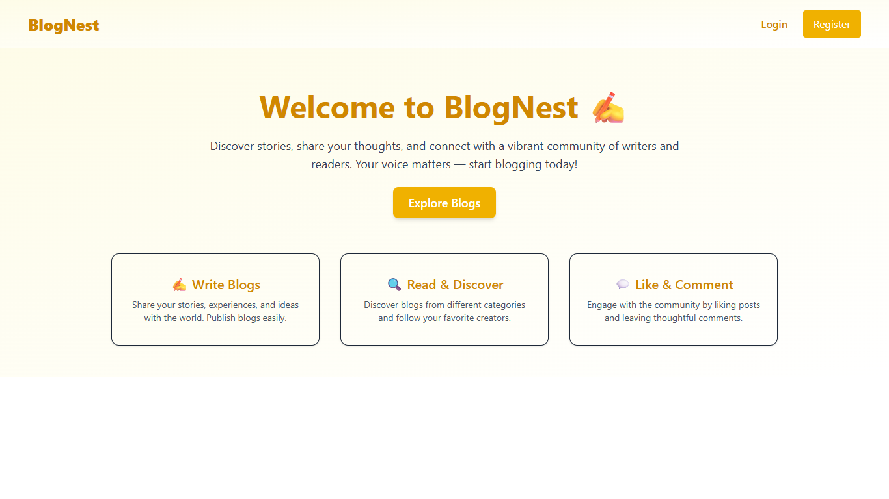
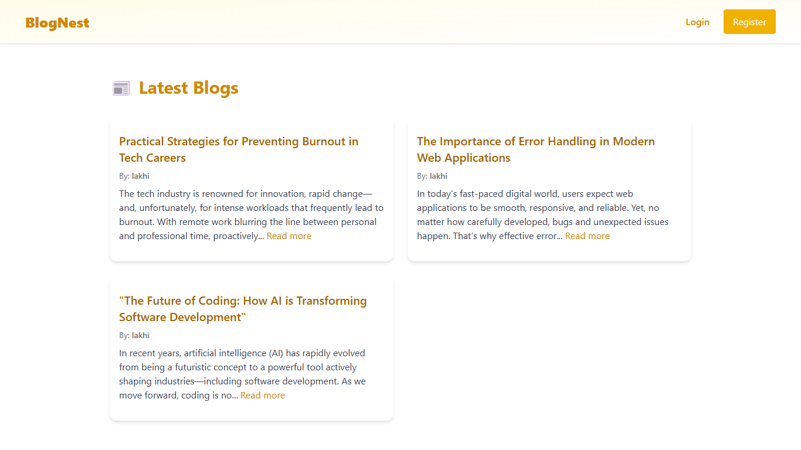
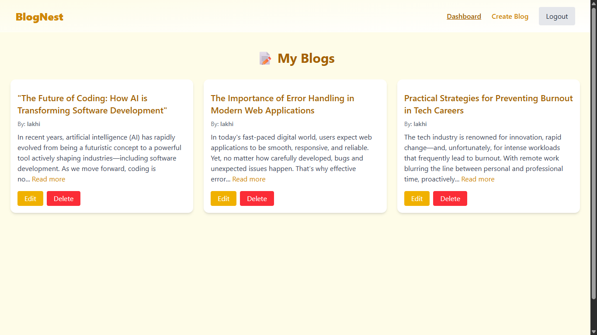
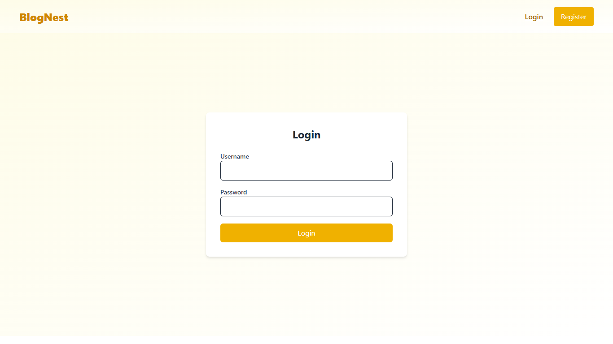

# BlogNest

📌 Project Overview

BlogNest is a full-stack blogging website designed to provide users with a platform where they can create, read, update, and interact with blogs. The project is built using React.js for the frontend and Django with Django REST Framework (DRF) for the backend, ensuring a clean separation of concerns and smooth API-driven communication.

The goal of BlogNest is to create an interactive, user-friendly blogging experience with secure authentication, profile management.

---

## 📸 Screenshots

Here are some previews of the project:








---

## 🛠️ Tech Stack

- **Frontend:** React.js, Tailwind CSS
- **Backend:** Django / Django Restframework
- **Database:** MySQL 

---

## ⚙️ Installation

1. Clone the repository:
   ```bash
   git clone https://github.com/W-lakhi-W/BlogNest.git
2. Change Directory:
   ```bash
   cd front_design
3. Install Dependencies:
   ```bash
   npm install
4. Run Project
   ```bash
   npm run dev
## For backend installation

1. Install the dependencies:
   install python, django, restframework using pip

2. Make migrations and migrate
   ```bash
   python manage.py makemigrations
   python manage.py migrate
   
3. Run server
   ```bash
   python manage.py runserver

